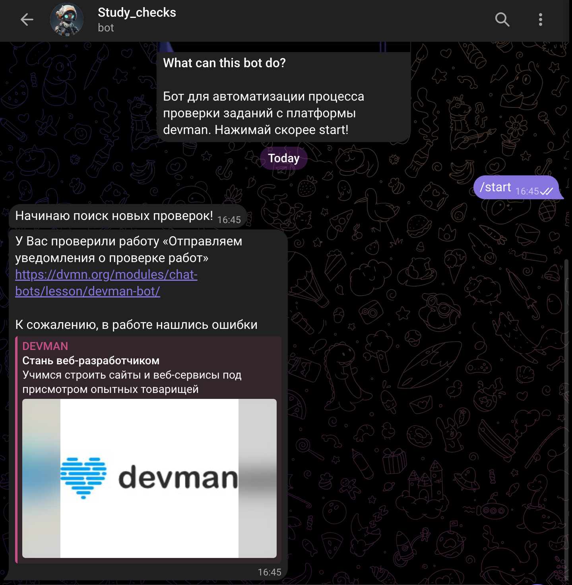

# Бот Чекер!

<p align="center">
  
</p>


## Данный бот автоматизирует процесс проверки отправленных заданий

### Шаги для запуска бота!

1. Клонирование репозитория:

```bash
    git clone https://github.com/azamat1012/Bot_checker.git
```
    
2. Поменяйте директорию:

```bash
    cd Bot_checker
```

3. Установка зависимостей:

```bash
    pip install -r requirements.txt
```

4. Создайте файл с расширением .env

```bash
    touch .env
```

5. В своем .env файле напишите два ключа:

```bash
    DEVMAN_API=ВАШ_ДЕВМАН_АПИ
    TG_API=ВАШ_ТГ_АПИ
```
6. Запуск бота

```bash
    python main.py
```

7. Далее Вам следует запустить Вашего бота в ТГ  и бот начнет поиск заданий.

Удачного пользования!!